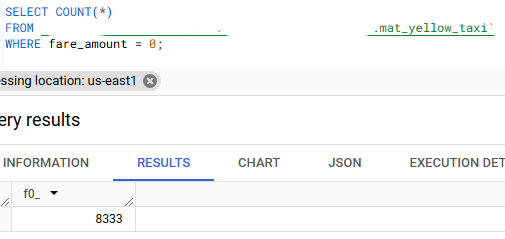

# Week 3: Data Warehouse

Accompanying script: 03-data-warehouse\script.sql

## Question 1

**Question:**

What is count of records for the 2024 Yellow Taxi Data?

- 65,623
- 840,402
- 20,332,093
- 85,431,289

**Answer:**
- `20,332,093`

Queried the materialized table in BigQuery:

## Question 2

**Question:**

Write a query to count the distinct number of PULocationIDs for the entire dataset on both the tables.
What is the estimated amount of data that will be read when this query is executed on the External Table and the Table?

- 18.82 MB for the External Table and 47.60 MB for the Materialized Table
- 0 MB for the External Table and 155.12 MB for the Materialized Table
- 2.14 GB for the External Table and 0MB for the Materialized Table
- 0 MB for the External Table and 0MB for the Materialized Table

**Answer:**
- `0 MB for the External Table and 155.12 MB for the Materialized Table`

For the external table:

For the materialized table:

## Question 3

**Question:**

Write a query to retrieve the PULocationID from the table (not the external table) in BigQuery. Now write a query to retrieve the PULocationID and DOLocationID on the same table. Why are the estimated number of Bytes different?

- BigQuery is a columnar database, and it only scans the specific columns requested in the query. Querying two columns (PULocationID, DOLocationID) requires reading more data than querying one column (PULocationID), leading to a higher estimated number of bytes processed.
- BigQuery duplicates data across multiple storage partitions, so selecting two columns instead of one requires scanning the table twice, doubling the estimated bytes processed.
- BigQuery automatically caches the first queried column, so adding a second column increases processing time but does not affect the estimated bytes scanned.
- When selecting multiple columns, BigQuery performs an implicit join operation between them, increasing the estimated bytes processed

**Answer:**
- `BigQuery is a columnar database, and it only scans the specific columns requested in the query. Querying two columns (PULocationID, DOLocationID) requires reading more data than querying one column (PULocationID), leading to a higher estimated number of bytes processed`

BigQuery uses columnar storage, as covered in the lecture:

## Question 4

**Question:**

How many records have a fare_amount of 0?

- 128,210
- 546,578
- 20,188,016
- 8,333

**Answer:**
- `8,333`

Queried in BigQuery:

## Question 5

**Question:**

What is the best strategy to make an optimized table in Big Query if your query will always filter based on tpep_dropoff_datetime and order the results by VendorID (Create a new table with this strategy)

- Partition by tpep_dropoff_datetime and Cluster on VendorID
- Cluster on by tpep_dropoff_datetime and Cluster on VendorID
- Cluster on tpep_dropoff_datetime Partition by VendorID
- Partition by tpep_dropoff_datetime and Partition by VendorID

**Answer:**
- `Partition by tpep_dropoff_datetime and Cluster on VendorID`

Clustering on tpep_dropoff_datetime would not be helpful because it has too high cardinality. Too many unique values to be sorted, it would add overhead.
Partitioning on tpep_dropoff_datetime is a better choice, but with a caveat. Partitioning on the column 'as is' would result in too many partitions, given the uniqueness of the column.
The column would need to either be transformed to DATE or to MONTH when partitioning.
When partitioning by DATE, the resulting partition size is small, much less than the ideal 1GB.
Also, it wouldn't scale well, at some point, with enough years of data, it would reach the partition limit in GCP.
I think partitioning by MONTH(tpep_dropoff_datetime) would be optimal.

VendorID on the other hand, lends itself well to clustering, because of its low cardinality. 
When used for partitioning, we could end up with too few partitions that could be uneven.
Also, tpep_dropoff_datetime will always be used in the filter, and VendorID in aggregations or sorts, which makes it ideal for clustering (filter first with partition, use cluster then for operations).

Different sizes of partitions:

Daily partitioning:

Monthly partitioning:

## Question 6

**Question:**

Write a query to retrieve the distinct VendorIDs between tpep_dropoff_datetime 2024-03-01 and 2024-03-15 (inclusive)

Use the materialized table you created earlier in your from clause and note the estimated bytes. Now change the table in the from clause to the partitioned table you created for question 5 and note the estimated bytes processed. What are these values?

Choose the answer which most closely matches.

- 12.47 MB for non-partitioned table and 326.42 MB for the partitioned table
- 310.24 MB for non-partitioned table and 26.84 MB for the partitioned table
- 5.87 MB for non-partitioned table and 0 MB for the partitioned table
- 310.31 MB for non-partitioned table and 285.64 MB for the partitioned table

**Answer:**
- `310.24 MB for non-partitioned table and 26.84 MB for the partitioned table`

Materialized table, not partitioned:

Materialized table, partitioned by DATE:

## Question 7

**Question:**

Where is the data stored in the External Table you created?

- Big Query
- Container Registry
- GCP Bucket
- Big Table

**Answer:**
- `GCP Bucket`

External tables do not contain data. It is pointing to the bucket and reading data directly from the files there.

## Question 8

**Question:**

It is best practice in Big Query to always cluster your data:

- True
- False

**Answer:**
- `False`

There are some cases where clustering will not be beneficial and add overhead or unnecessary cost (small tables, frequent write to tables...etc), so it should be a decision taken based on the requirements and characteristics of the data. In general, though, I would say its best practice to always consider it and lean towards applying it unless there's a clear reason not to.

## Question 9

**Question:**

No Points: Write a SELECT count(*) query FROM the materialized table you created. How many bytes does it estimate will be read? Why?

**Answer:**

It estimates 0B. Im guessing that this is because the total row count is stored as metadata of the table and so the table does not need to be scanned.