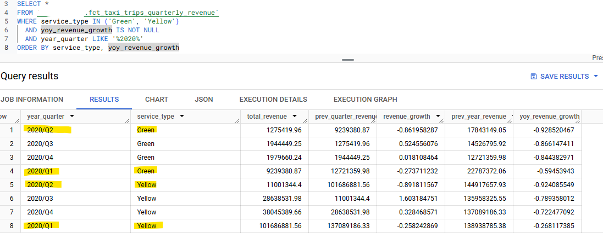
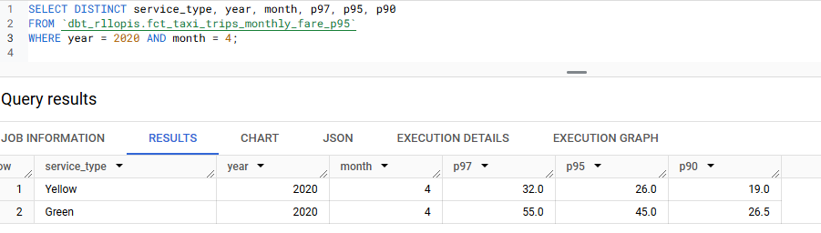

# Week 4: Analytics Engineering

## Question 1. Understanding dbt model resolution

**Question:**

Provided you've got the following sources.yaml

version: 2

sources:
  - name: raw_nyc_tripdata
    database: "{{ env_var('DBT_BIGQUERY_PROJECT', 'dtc_zoomcamp_2025') }}"
    schema:   "{{ env_var('DBT_BIGQUERY_SOURCE_DATASET', 'raw_nyc_tripdata') }}"
    tables:
      - name: ext_green_taxi
      - name: ext_yellow_taxi
with the following env variables setup where dbt runs:

export DBT_BIGQUERY_PROJECT=myproject
export DBT_BIGQUERY_DATASET=my_nyc_tripdata
What does this .sql model compile to?

- select * from {{ source('raw_nyc_tripdata', 'ext_green_taxi' ) }}
- select * from dtc_zoomcamp_2025.raw_nyc_tripdata.ext_green_taxi
- select * from dtc_zoomcamp_2025.my_nyc_tripdata.ext_green_taxi
- select * from myproject.raw_nyc_tripdata.ext_green_taxi
- select * from myproject.my_nyc_tripdata.ext_green_taxi
- select * from dtc_zoomcamp_2025.raw_nyc_tripdata.green_taxi

**Answer:**

- `select * from dtc_zoomcamp_2025.my_nyc_tripdata.ext_green_taxi`

Uses env variable DBT_BIGQUERY_PROJECT which is set to myproject but then uses default raw_nyc_tripdata, as DBT_BIGQUERY_SOURCE_DATASET is not set.

## Question 2. dbt Variables & Dynamic Models

**Question:**

Say you have to modify the following dbt_model (fct_recent_taxi_trips.sql) to enable Analytics Engineers to dynamically control the date range.

In development, you want to process only the last 7 days of trips
In production, you need to process the last 30 days for analytics
select *
from {{ ref('fact_taxi_trips') }}
where pickup_datetime >= CURRENT_DATE - INTERVAL '30' DAY
What would you change to accomplish that in a such way that command line arguments takes precedence over ENV_VARs, which takes precedence over DEFAULT value?

- Add ORDER BY pickup_datetime DESC and LIMIT {{ var("days_back", 30) }}
- Update the WHERE clause to pickup_datetime >= CURRENT_DATE - INTERVAL '{{ var("days_back", 30) }}' DAY
- Update the WHERE clause to pickup_datetime >= CURRENT_DATE - INTERVAL '{{ env_var("DAYS_BACK", "30") }}' DAY
- Update the WHERE clause to pickup_datetime >= CURRENT_DATE - INTERVAL '{{ var("days_back", env_var("DAYS_BACK", "30")) }}' DAY
- Update the WHERE clause to pickup_datetime >= CURRENT_DATE - INTERVAL '{{ env_var("DAYS_BACK", var("days_back", "30")) }}' DAY

**Answer:**

- `Update the WHERE clause to pickup_datetime >= CURRENT_DATE - INTERVAL '{{ var("days_back", env_var("DAYS_BACK", "30")) }}' DAY`

Choose in order: provided command line argument, env variable, default value.

## Question 3. dbt Data Lineage and Execution

**Question:**

Considering the data lineage below and that taxi_zone_lookup is the only materialization build (from a .csv seed file):

Select the option that does NOT apply for materializing fct_taxi_monthly_zone_revenue:

- dbt run
- dbt run --select +models/core/dim_taxi_trips.sql+ --target prod
- dbt run --select +models/core/fct_taxi_monthly_zone_revenue.sql
- dbt run --select +models/core/
- dbt run --select models/staging/+

**Answer:**

- `dbt run --select models/staging/+`

dbt run executes everything, and the rest include downstream dependencies. The exception is dbt run --select models/staging/+, which only runs staging models and their direct downstream dependencies, but not necessarily the full lineage to fct_taxi_monthly_zone_revenue

## Question 4. dbt Macros and Jinja

**Question:**

Consider you're dealing with sensitive data (e.g.: PII), that is only available to your team and very selected few individuals, in the raw layer of your DWH (e.g: a specific BigQuery dataset or PostgreSQL schema),

Among other things, you decide to obfuscate/masquerade that data through your staging models, and make it available in a different schema (a staging layer) for other Data/Analytics Engineers to explore

And optionally, yet another layer (service layer), where you'll build your dimension (dim_) and fact (fct_) tables (assuming the Star Schema dimensional modeling) for Dashboarding and for Tech Product Owners/Managers

You decide to make a macro to wrap a logic around it:



    
    

     {{- env_var(target_env_var) -}}
                        {{- env_var(stging_env_var, env_var(target_env_var)) -}}
    


And use on your staging, dim_ and fact_ models as:

{{ config(
    schema=resolve_schema_for('core'), 
) }}
That all being said, regarding macro above, select all statements that are true to the models using it:

- Setting a value for DBT_BIGQUERY_TARGET_DATASET env var is mandatory, or it'll fail to compile
- Setting a value for DBT_BIGQUERY_STAGING_DATASET env var is mandatory, or it'll fail to compile
- When using core, it materializes in the dataset defined in DBT_BIGQUERY_TARGET_DATASET
- When using stg, it materializes in the dataset defined in DBT_BIGQUERY_STAGING_DATASET, or defaults to DBT_BIGQUERY_TARGET_DATASET
- When using staging, it materializes in the dataset defined in DBT_BIGQUERY_STAGING_DATASET, or defaults to DBT_BIGQUERY_TARGET_DATASET

**Answer:**

All except [Setting a value for DBT_BIGQUERY_STAGING_DATASET env var is mandatory, or it'll fail to compile] as it has a fallback value [env_var(target_env_var)]

## Question 5. Taxi Quarterly Revenue Growth

**Question:**

Create a new model fct_taxi_trips_quarterly_revenue.sql
Compute the Quarterly Revenues for each year for based on total_amount
Compute the Quarterly YoY (Year-over-Year) revenue growth
e.g.: In 2020/Q1, Green Taxi had -12.34% revenue growth compared to 2019/Q1
e.g.: In 2020/Q4, Yellow Taxi had +34.56% revenue growth compared to 2019/Q4
Considering the YoY Growth in 2020, which were the yearly quarters with the best (or less worse) and worst results for green, and yellow

- green: {best: 2020/Q2, worst: 2020/Q1}, yellow: {best: 2020/Q2, worst: 2020/Q1}
- green: {best: 2020/Q2, worst: 2020/Q1}, yellow: {best: 2020/Q3, worst: 2020/Q4}
- green: {best: 2020/Q1, worst: 2020/Q2}, yellow: {best: 2020/Q2, worst: 2020/Q1}
- green: {best: 2020/Q1, worst: 2020/Q2}, yellow: {best: 2020/Q1, worst: 2020/Q2}
- green: {best: 2020/Q1, worst: 2020/Q2}, yellow: {best: 2020/Q3, worst: 2020/Q4}

**Answer:**

Created a dim_date model and a precomputed model fct_taxi_trips_quarterly_revenue so then queried simply (ignore 2021 and others):

## Question 6. P97/P95/P90 Taxi Monthly Fare

**Question:**

Create a new model fct_taxi_trips_monthly_fare_p95.sql
Filter out invalid entries (fare_amount > 0, trip_distance > 0, and payment_type_description in ('Cash', 'Credit Card'))
Compute the continous percentile of fare_amount partitioning by service_type, year and and month
Now, what are the values of p97, p95, p90 for Green Taxi and Yellow Taxi, in April 2020?

- green: {p97: 55.0, p95: 45.0, p90: 26.5}, yellow: {p97: 52.0, p95: 37.0, p90: 25.5}
- green: {p97: 55.0, p95: 45.0, p90: 26.5}, yellow: {p97: 31.5, p95: 25.5, p90: 19.0}
- green: {p97: 40.0, p95: 33.0, p90: 24.5}, yellow: {p97: 52.0, p95: 37.0, p90: 25.5}
- green: {p97: 40.0, p95: 33.0, p90: 24.5}, yellow: {p97: 31.5, p95: 25.5, p90: 19.0}
- green: {p97: 55.0, p95: 45.0, p90: 26.5}, yellow: {p97: 52.0, p95: 25.5, p90: 19.0}

**Answer:**

- `green: {p97: 55.0, p95: 45.0, p90: 26.5}, yellow: {p97: 31.5, p95: 25.5, p90: 19.0}`

Created the model then queried it:

## Question 7. Top #Nth longest P90 travel time Location for FHV

**Question:**
Prerequisites:

Create a staging model for FHV Data (2019), and DO NOT add a deduplication step, just filter out the entries where where dispatching_base_num is not null
Create a core model for FHV Data (dim_fhv_trips.sql) joining with dim_zones. Similar to what has been done here
Add some new dimensions year (e.g.: 2019) and month (e.g.: 1, 2, ..., 12), based on pickup_datetime, to the core model to facilitate filtering for your queries
Now...

Create a new model fct_fhv_monthly_zone_traveltime_p90.sql
For each record in dim_fhv_trips.sql, compute the timestamp_diff in seconds between dropoff_datetime and pickup_datetime - we'll call it trip_duration for this exercise
Compute the continous p90 of trip_duration partitioning by year, month, pickup_location_id, and dropoff_location_id
For the Trips that respectively started from Newark Airport, SoHo, and Yorkville East, in November 2019, what are dropoff_zones with the 2nd longest p90 trip_duration ?

- LaGuardia Airport, Chinatown, Garment District
- LaGuardia Airport, Park Slope, Clinton East
- LaGuardia Airport, Saint Albans, Howard Beach
- LaGuardia Airport, Rosedale, Bath Beach
- LaGuardia Airport, Yorkville East, Greenpoint