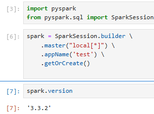
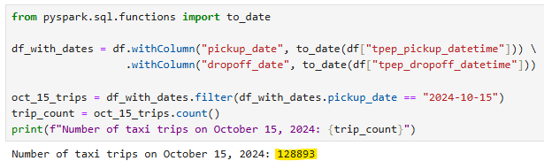
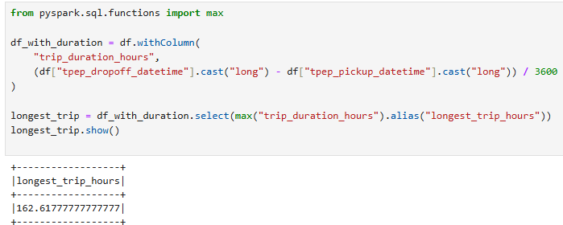
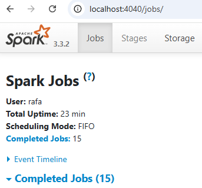
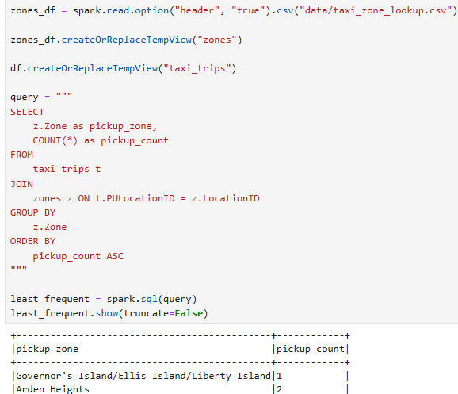

# Week 5: Batch

## Question 1. Install Spark and PySpark

**Question:**

- Install Spark
- Run PySpark
- Create a local spark session
- Execute spark.version.
What's the output?

**Answer:**

3.3.2

## Question 2. Yellow October 2024

**Question:**

Read the October 2024 Yellow into a Spark Dataframe.

Repartition the Dataframe to 4 partitions and save it to parquet.

What is the average size of the Parquet (ending with .parquet extension) Files that were created (in MB)? Select the answer which most closely matches.

- 6MB
- 25MB
- 75MB
- 100MB

**Answer:**

- `25MB`

## Question 3. Count records

**Question:**

How many taxi trips were there on the 15th of October?

Consider only trips that started on the 15th of October.

- 85,567
- 105,567
- 125,567
- 145,567

**Answer:**

- `125,567`

I got 128,893. Marking the closest one.

## Question 4. Longest trip

**Question:**

What is the length of the longest trip in the dataset in hours?

- 122
- 142
- 162
- 182

**Answer:**

- `162`

## Question 5. User Interface

**Question:**

Spark’s User Interface which shows the application's dashboard runs on which local port?

- 80
- 443
- 4040
- 8080

**Answer:**

- `4040`

## Question 6. Least frequent pickup location zone

**Question:**

Load the zone lookup data into a temp view in Spark:

wget https://d37ci6vzurychx.cloudfront.net/misc/taxi_zone_lookup.csv
Using the zone lookup data and the Yellow October 2024 data, what is the name of the LEAST frequent pickup location Zone?

- Governor's Island/Ellis Island/Liberty Island
- Arden Heights
- Rikers Island
- Jamaica Bay

**Answer:**

- `Governor's Island/Ellis Island/Liberty Island`

