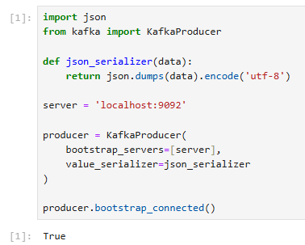
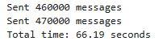
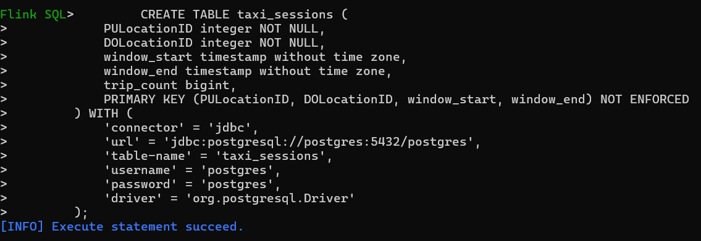
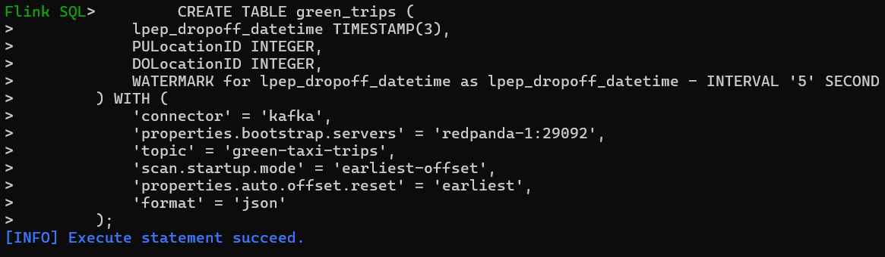
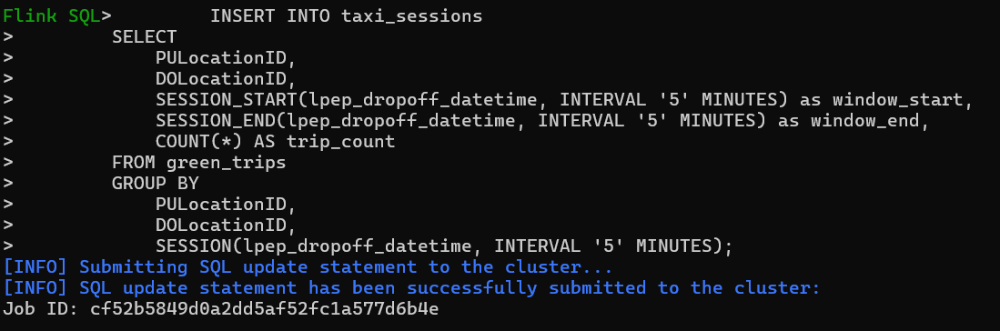
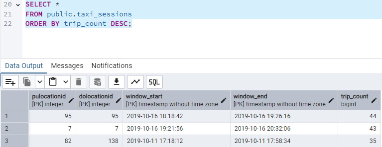

# Week 6: Streaming

## Question 1. Redpanda version

**Question:**

Now let's find out the version of redpandas.
For that, check the output of the command rpk help inside the container. The name of the container is redpanda-1.
Find out what you need to execute based on the help output.
What's the version, based on the output of the command you executed? (copy the entire version)

**Answer:**

With help, it displays that we must use 'version' to retrieve the version

The output was:

```
$ docker exec -it redpanda-1 rpk version
Version:     v24.2.18
Git ref:     f9a22d4430
Build date:  2025-02-14T12:52:55Z
OS/Arch:     linux/amd64
Go version:  go1.23.1

Redpanda Cluster
  node-1  v24.2.18 - f9a22d443087b824803638623d6b7492ec8221f9
```

So the version is `v24.2.18`

## Question 2. Creating a topic

**Question:**

Before we can send data to the redpanda server, we need to create a topic. We do it also with the rpk command we used previously for figuring out the version of redpandas.

Read the output of help and based on it, create a topic with name green-trips

What's the output of the command for creating a topic? Include the entire output in your answer.

**Answer:**

Topic created:

```
$ docker exec -it redpanda-1 rpk topic create green-trips
TOPIC        STATUS
green-trips  OK
```


## Question 3. Connecting to the Kafka server

**Question:**

We need to make sure we can connect to the server, so
later we can send some data to its topics

First, let's install the kafka connector (up to you if you
want to have a separate virtual environment for that)

```bash
pip install kafka-python
```

You can start a jupyter notebook in your solution folder or
create a script

Let's try to connect to our server:

```python
import json

from kafka import KafkaProducer

def json_serializer(data):
    return json.dumps(data).encode('utf-8')

server = 'localhost:9092'

producer = KafkaProducer(
    bootstrap_servers=[server],
    value_serializer=json_serializer
)

producer.bootstrap_connected()
```

Provided that you can connect to the server, what's the output
of the last command?

**Answer:**

Returned `True` in jupyter notebook:




## Question 4. Sending the Trip Data

**Question:**

Now we need to send the data to the `green-trips` topic

Read the data, and keep only these columns:

* `'lpep_pickup_datetime',`
* `'lpep_dropoff_datetime',`
* `'PULocationID',`
* `'DOLocationID',`
* `'passenger_count',`
* `'trip_distance',`
* `'tip_amount'`

Now send all the data using this code:

```python
producer.send(topic_name, value=message)
```

For each row (`message`) in the dataset. In this case, `message`
is a dictionary.

After sending all the messages, flush the data:

```python
producer.flush()
```

Use `from time import time` to see the total time 

```python
from time import time

t0 = time()

# ... your code

t1 = time()
took = t1 - t0
```

How much time did it take to send the entire dataset and flush? 

**Answer:**

It took `66.19 seconds`




## Question 5. Sending the Trip Data

**Question:**

Now we have the data in the Kafka stream. It's time to process it.

* Copy `aggregation_job.py` and rename it to `session_job.py`
* Have it read from `green-trips` fixing the schema
* Use a [session window](https://nightlies.apache.org/flink/flink-docs-master/docs/dev/datastream/operators/windows/) with a gap of 5 minutes
* Use `lpep_dropoff_datetime` time as your watermark with a 5 second tolerance
* Which pickup and drop off locations have the longest unbroken streak of taxi trips?


**Answer:**

`91 (Forest Hills)`

I've sadly not been able to fully implement the job but I got this far:
- Open Flink SQL client
- Create a source table


- Create a sink table


- Insert into the sink from the source with a session window


Then in pgadmin:



Judging by this:
1st place - 91 (Forest Hills) as a dropoff and pickup
2nd place - 7 (Astoria) as a dropoff and pickup
3rd place - 82 (Elmhurst) pickup and 138 (LaGuardia Airport) drop off