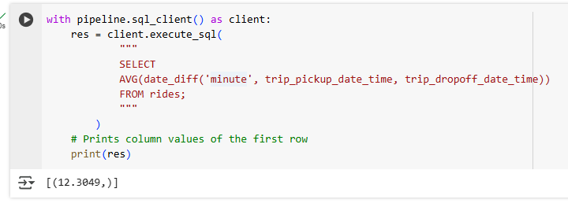

# Workshop 1:

Followed along using the notebook.

## Question 1

**Question:**

Check the dlt version

**Answer:**
- 1.6.1

## Question 2

**Question:**

How many tables were created?

- 2
- 4
- 6
- 8

**Answer:**
- 4

## Question 3

**Question:**

What is the total number of records extracted?

- 2500
- 5000
- 7500
- 10000

**Answer:**
- 10000

## Question 4

**Question:**

What is the average trip duration?

- 12.3049
- 22.3049
- 32.3049
- 42.3049

**Answer:**
- `12.3049`

